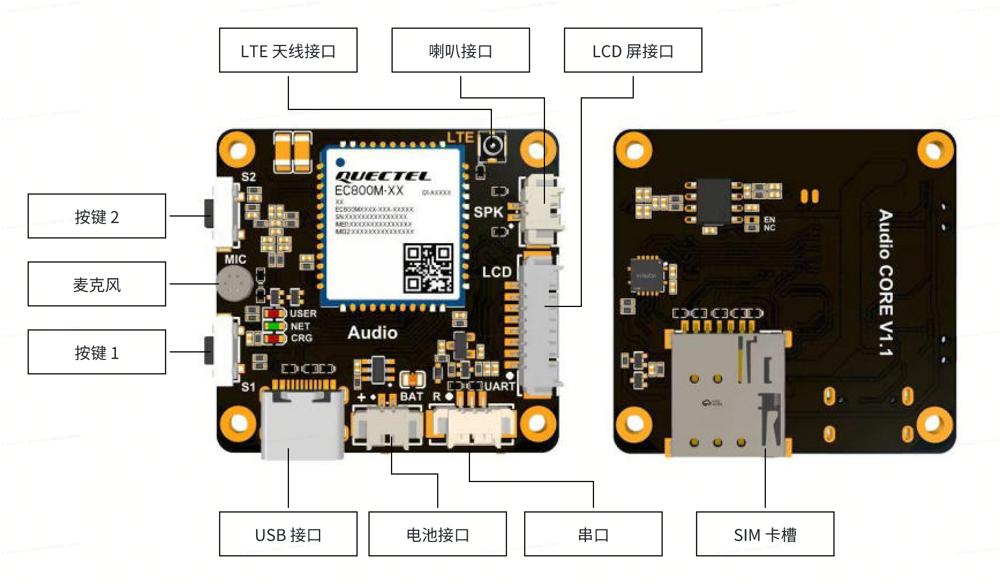
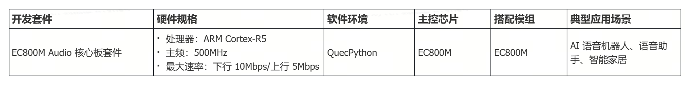

# EC800M Audio 核心板套件

EC800M Audio核心板套件是一款搭载移远EC800M系列模组的具有语音功能的板卡。板载天线接口、MIC、喇叭接口、串口、电池接口、SIM卡槽，并且预留了LCD接口。

EC800M 固件集成了回声消除、噪声抑制、KWS关键词识别等语音算法，可用来对接小智AI、豆包、Coze，以及ChatGPT等大模型平台，并提供了丰富的基于QuecPython的大模型平台对接参考案例。

用户可基于EC800M模组提供的本地语音算法或大模型提供的相关功能，实现AI语音助手、陪伴机器人、智能家居等方向的产品开发。

